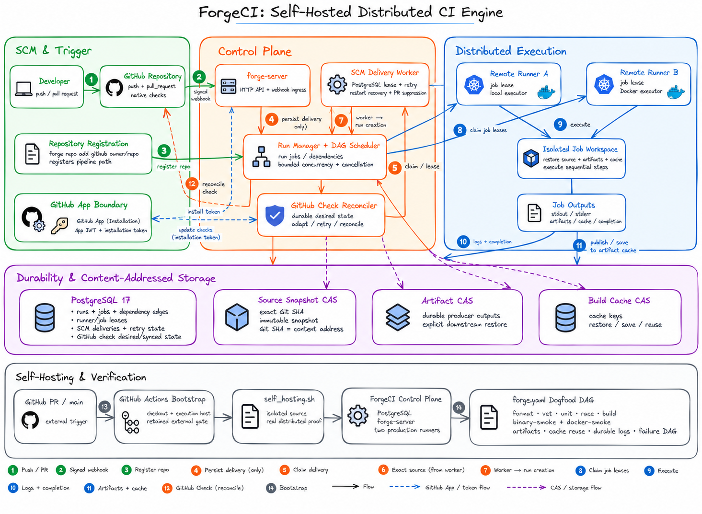

# ForgeCI

**A self-hosted distributed CI engine built from scratch in Go.**

ForgeCI explores the systems behind modern CI platforms: DAG scheduling, remote execution, durable state, job leases, immutable source transport, artifacts, caching, live logs, failure recovery, native GitHub integration, and self-hosting.

Rather than wrapping an existing CI service, ForgeCI implements its own control plane, runner protocol, persistence model, source transport, and execution lifecycle.



---

## Why ForgeCI?

A CI system looks simple from the outside:

```text
push code → run jobs → report success
```

But a distributed implementation has to answer much harder questions:

- How do multiple runners safely compete for work?
- What happens if a runner disappears while executing a job?
- How do you guarantee that CI executes the exact commit that triggered it?
- How do jobs exchange artifacts without sharing a mutable workspace?
- How are logs preserved if a server restarts?
- How do retries avoid creating duplicate runs?
- How do GitHub Checks recover after API failures?
- How can the CI engine prove that it can build and test itself?

ForgeCI was built to explore those problems directly.

---

## What ForgeCI supports

### Pipeline execution

- YAML-defined DAG pipelines
- dependency-aware job scheduling
- deterministic dependency validation
- bounded parallelism
- local shell execution
- one-container-per-job Docker execution
- failure propagation while independent DAG branches continue
- run and job cancellation

### Distributed runners

- standalone `forge-runner` processes
- authenticated runner registration
- PostgreSQL-backed job leasing
- lease ownership and stale-worker protection
- runner capacity enforcement
- local and Docker executors
- isolated per-job workspaces
- bounded backpressure and lifecycle handling

### Reproducible source execution

- immutable source snapshots
- content-addressed source storage
- exact Git revision execution for native SCM runs
- detached checkout of the webhook commit SHA
- pull requests fetched through `refs/pull/<n>/head`
- protection against moving branch heads
- pipeline path containment and symlink-escape rejection

The Git commit SHA and ForgeCI snapshot digest remain separate identities:

```text
Git commit SHA
      │
      ▼
exact checkout
      │
      ▼
immutable ForgeCI source snapshot
      │
      ▼
content-addressed snapshot digest
```

### Artifacts and cache

- durable artifact publication
- explicit downstream artifact restoration
- content-addressed artifact storage
- reusable build caches
- explicit cache keys
- restore/save lifecycle
- cross-runner artifact transport

### Durable logs

- persisted stdout/stderr chunks
- shared ordering across both streams
- bounded remote buffering
- retry-safe remote upload
- durable PostgreSQL storage
- reconnect-safe retrieval
- live log following with:

```bash
forge logs <run-id> <job-name> --follow
```

### Native GitHub SCM

ForgeCI can operate directly from GitHub using a GitHub App.

Supported flow:

```text
GitHub push / pull request
          │
          ▼
signed webhook
          │
          ▼
durable SCM delivery
          │
          ▼
PostgreSQL worker lease
          │
          ▼
GitHub App installation token
          │
          ▼
exact Git revision
          │
          ▼
immutable source snapshot
          │
          ▼
ForgeCI run
          │
          ▼
GitHub Check
```

Native SCM includes:

- repository registration
- signed HMAC-SHA256 webhooks
- GitHub App JWT authentication
- short-lived installation tokens
- memory-only token caching
- exact revision fetching
- durable delivery leases
- retry and restart recovery
- one-delivery-to-one-run guarantees
- GitHub Check creation and reconciliation
- pull-request supersession and cancellation

Register a repository with:

```bash
forge repo add github owner/repo --pipeline forge.yaml
```

See [`docs/github-scm.md`](docs/github-scm.md) for setup details.

---

## Architecture

ForgeCI is split into four major areas.

### 1. SCM and trigger layer

GitHub events enter through the HTTP API.

Webhook bodies are authenticated before parsing, normalized into provider-neutral SCM events, and persisted before asynchronous processing begins.

The webhook handler itself does not clone repositories or execute CI work.

### 2. Control plane

`forge-server` owns durable orchestration.

It manages:

- pipeline runs
- jobs and dependency edges
- runner inventory
- job leases
- SCM deliveries
- retry state
- source snapshots
- artifact metadata
- cache metadata
- durable logs
- GitHub Check reconciliation

PostgreSQL provides the concurrency boundary for distributed claims and state transitions.

### 3. Distributed execution

Remote runners claim eligible jobs from the server.

Each job receives:

- an immutable source snapshot
- declared upstream artifacts
- restored caches
- a fenced job lease

The runner executes the job in an isolated workspace and returns:

- stdout/stderr
- artifacts
- cache updates
- final status

### 4. Content-addressed storage

ForgeCI keeps source, artifact, and cache storage logically separate:

```text
Source Snapshot CAS
Artifact CAS
Build Cache CAS
```

This prevents one storage abstraction from silently taking on multiple identities or lifecycle rules.

---

## Correctness properties

Several invariants are deliberately enforced at the database and protocol layers.

### One SCM delivery creates at most one run

Run creation and the SCM trigger association are persisted transactionally.

A server crash at the creation boundary cannot cause a retry to create another run.

### A stale worker cannot overwrite a newer owner

SCM deliveries and jobs use fenced leases.

Operations such as:

```text
complete
retry
renew
fail
```

must match the current lease owner.

Expired workers cannot overwrite state after another worker has reclaimed the work.

### CI executes the event revision, not the current branch

If GitHub sends an event for commit `A` and the branch later advances to `B`, ForgeCI still executes `A`.

The resulting immutable source snapshot is built from `A`, not the branch's current head.

### External status is recoverable

GitHub Check state is durable.

If GitHub is unavailable when a run completes, ForgeCI can reconcile the correct terminal Check later.

---

## Security model

ForgeCI treats source repositories and execution environments as trusted, but protects the control-plane credential and protocol boundaries.

### GitHub credentials

Installation tokens:

- remain memory-only
- never appear in Git command arguments
- never enter clone URLs
- never enter `.git/config`
- are never persisted to PostgreSQL
- are removed with the temporary credential helper

Git authentication uses an ephemeral owner-only `GIT_ASKPASS` helper.

### Git transport

The Git remote is built only from:

```text
operator-configured clone base
+
registered owner/repository identity
```

Webhook-provided values such as:

```text
clone_url
ssh_url
git_url
```

are never trusted for source acquisition.

Repository identities containing URL/userinfo-style injection such as `@` are rejected.

### Bounded inputs

ForgeCI places explicit limits on several externally controlled paths, including:

- webhook bodies
- API request bodies
- GitHub API responses
- Git subprocess diagnostics
- pending log buffers
- log chunk sizes
- artifact/source capture

Git subprocess diagnostics are bounded while being read rather than buffered without limit and truncated afterward.

---

## ForgeCI runs ForgeCI

The repository contains its own ForgeCI pipeline:

```text
forge.yaml
```

The dogfood DAG runs:

```text
format
   │
   ├── vet
   │
   └── unit
         │
         ├── race
         │
         └── build
                │
                ├── binary-smoke
                └── docker-smoke
```

The self-hosting integration starts:

```text
PostgreSQL
forge-server
Remote Runner A
Remote Runner B
```

and submits ForgeCI's own repository to ForgeCI.

The harness verifies:

- distributed job placement
- multiple real runners
- Docker execution
- immutable source transport
- artifact publication and restoration
- cache reuse across runs
- durable stdout/stderr
- expected failure propagation
- independent DAG branch execution

Run it with:

```bash
./tools/integration/self_hosting.sh
```

GitHub Actions remains as an external bootstrap gate. It provides checkout and an execution host, while **ForgeCI itself owns and evaluates the CI DAG**.

---

## Example pipeline

```yaml
version: 1

jobs:
  test:
    steps:
      - run: go test ./...

  build:
    needs: [test]
    steps:
      - run: |
          mkdir -p dist
          go build -o dist/app ./cmd/app
    artifacts:
      upload:
        - name: binaries
          path: dist

  smoke:
    needs: [build]
    image: alpine:3.20
    artifacts:
      download:
        - from: build
          name: binaries
          into: input
    steps:
      - run: test -f input/dist/app
```

See [`docs/pipeline-format.md`](docs/pipeline-format.md) for the full format.

---

## Quick start

ForgeCI requires **Go 1.27+**.

Docker execution requires access to a Docker Engine.

### Build

```bash
mkdir -p build

go build -o build/forge ./cmd/forge
go build -o build/forge-server ./cmd/forge-server
go build -o build/forge-runner ./cmd/forge-runner
```

### Run a pipeline locally

```bash
./build/forge run --file forge.yaml
```

Direct mode executes the same pipeline parser/compiler/scheduler without requiring PostgreSQL.

---

## Server-backed execution

A distributed deployment consists of:

```text
PostgreSQL
    │
    ▼
forge-server
    │
    ├── forge-runner
    ├── forge-runner
    └── ...
```

PostgreSQL stores durable control-plane state while source snapshots, artifacts, and cache blobs are maintained in their respective content-addressed stores.

For setup and operational details, see:

- [`docs/architecture.md`](docs/architecture.md)
- [`docs/control-plane.md`](docs/control-plane.md)
- [`docs/remote-runners.md`](docs/remote-runners.md)
- [`docs/github-scm.md`](docs/github-scm.md)

---

## CLI

ForgeCI provides three binaries:

```text
forge
forge-server
forge-runner
```

Useful commands include:

```bash
forge run
forge submit
forge wait
forge inspect
forge logs
forge repo add
forge repo list
forge repo remove
```

Example:

```bash
RUN_ID=$(forge submit \
  --quiet \
  --server http://127.0.0.1:8080 \
  --file forge.yaml)

forge wait "$RUN_ID" \
  --server http://127.0.0.1:8080 \
  --timeout 10m

forge logs "$RUN_ID" build \
  --server http://127.0.0.1:8080
```

---

## Verification

ForgeCI is tested at several levels.

### Unit and race testing

```bash
go test ./...
go test -race ./...
```

Critical concurrency-sensitive packages are also exercised repeatedly with `-count=100`.

### PostgreSQL concurrency testing

Real PostgreSQL integration tests cover:

- job leasing
- delivery leasing
- concurrent repository registration
- webhook replay
- delivery conflicts
- run-trigger idempotency
- stale worker rejection
- retry eligibility
- Check reconciliation

### Real-process integration

The repository contains integration harnesses for:

```text
control_plane.sh
job_logs_local.sh
job_logs.sh
remote_runners.sh
build_cache.sh
self_hosting.sh
github_scm.sh
```

These run real ForgeCI binaries, PostgreSQL, TCP communication, runners, Git repositories, and Docker where required.

### Mutation verification

Critical invariants are also mutation-tested.

The M12 mutation suite deliberately breaks protections such as:

- webhook authentication
- delivery replay conflicts
- hostile repository identity rejection
- exact-SHA execution
- PR revision verification
- Git credential isolation
- delivery lease ownership
- stale-worker fencing
- one-delivery-to-one-run idempotency
- restart recovery
- GitHub Check reconciliation
- PR supersession

The protecting tests must fail while the mutation exists and pass again after production behavior is restored.

---

## Repository layout

```text
cmd/
├── forge/
├── forge-server/
└── forge-runner/

internal/
├── api/
├── artifact/
├── cache/
├── cli/
├── executor/
├── joblog/
├── pipeline/
├── runner/
├── runnerproto/
├── scm/
├── source/
└── store/

docs/
tools/integration/
forge.yaml
```

The architecture deliberately keeps provider-specific GitHub behavior under the SCM boundary while generic Git transport, source snapshots, scheduling, and execution remain independent.

---

## Design boundaries

ForgeCI intentionally does **not** attempt to solve every CI/CD problem.

Currently out of scope:

- Kubernetes runner scheduling
- autoscaling
- GPU scheduling
- runner labels/selectors
- automatic job retry/reassignment after runner loss
- general pipeline secret injection
- RBAC / multi-tenant authorization
- highly available control plane
- hostile-code isolation

Docker execution requires daemon access and should not be treated as a security sandbox for untrusted workloads.

These boundaries are intentional: the project focuses on the distributed systems and correctness mechanisms behind CI execution rather than becoming a production replacement for every commercial CI platform.

---

## Documentation

More detailed design and operational notes are available in:

- [Architecture](docs/architecture.md)
- [Control plane](docs/control-plane.md)
- [Pipeline format](docs/pipeline-format.md)
- [Remote runners](docs/remote-runners.md)
- [Native GitHub SCM](docs/github-scm.md)
- [Self-hosting](docs/self-hosting.md)

---

## Project status

ForgeCI's planned engineering milestones are complete.

The final system includes:

```text
pipeline DAG
→ durable control plane
→ distributed runners
→ immutable source
→ artifacts + cache
→ durable live logs
→ self-hosting
→ native GitHub SCM
→ exact revision execution
→ restart recovery
→ GitHub Checks
```

The goal of the project is not to replace GitHub Actions or other mature CI systems.

It is to understand—and implement—the mechanisms that make a distributed CI system correct when concurrency, crashes, retries, remote workers, source reproducibility, and external SCM state all interact.