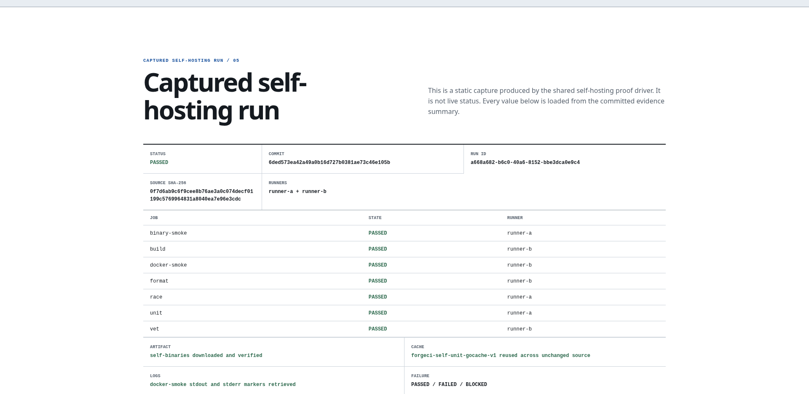
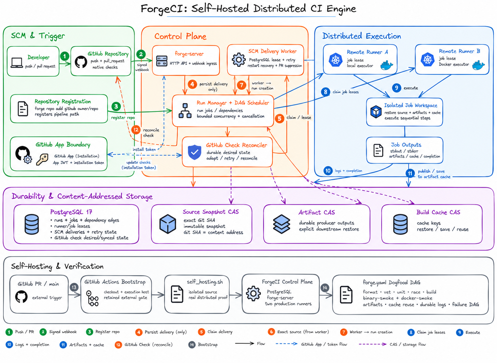

# ForgeCI

ForgeCI is a self-hosted distributed CI engine built from scratch in Go.

It implements DAG scheduling, PostgreSQL-backed job leasing, remote runners,
immutable source execution, artifacts, caching, durable logs, and native GitHub
SCM integration.

[Project showcase](https://nhatminh06.github.io/forgeci/) · [Demo guide](docs/demo.md) · [Architecture](docs/architecture.md) · [Captured evidence](docs/evidence/self-hosting/)



The screenshot above is the deployed public showcase. It describes the system
and links its claims to tests, integration harnesses, and captured evidence.

## What ForgeCI demonstrates

- Dependency-aware DAG scheduling with independent failure propagation.
- Fenced PostgreSQL leases for safe work ownership across remote runners.
- Exact Git revision checkout followed by immutable source snapshot execution.
- Explicit artifact transport between jobs running on different machines.
- Durable stdout and stderr storage plus cache reuse across unchanged source.
- Signed GitHub webhooks, idempotent delivery processing, and GitHub Checks.
- Self-hosting through a real server and two real runner processes.

## Captured self-hosting proof

The committed capture was produced by the same assertion-backed driver used by
the self-hosting integration test. It is static historical evidence, not live
service status.

| Check | Captured result |
| --- | --- |
| Status | `PASSED` |
| Runners | `runner-a`, `runner-b` |
| Jobs | 7 |
| Artifact | `self-binaries` downloaded and verified |
| Cache | Reused across unchanged source |
| Logs | Persisted stdout and stderr retrieved |

Job placement:

```text
runner-a
  binary-smoke
  race
  unit

runner-b
  build
  docker-smoke
  format
  vet
```

The artifact contains `forge`, `forge-server`, `forge-runner`, and
`build-marker.txt`. A second run uses the same source digest and advances cache
access metadata for `forgeci-self-unit-gocache-v1`. The captured Docker job log
contains both `forgeci-docker-smoke-stdout` and
`forgeci-docker-smoke-stderr`.

The deterministic failure fixture records:

```text
independent-pass    PASSED
intentional-fail    FAILED
blocked-dependent   BLOCKED
```

See the [evidence index](docs/evidence/self-hosting/),
[machine-readable summary](docs/evidence/self-hosting/summary.json), and
[SHA-256 manifest](docs/evidence/self-hosting/manifest.txt) for run IDs, the
source digest, and raw command output.

## Architecture



GitHub events enter through the SCM boundary. `forge-server` persists runs,
jobs, dependencies, runner state, leases, logs, and external status in
PostgreSQL. Remote runners claim eligible jobs and receive immutable source,
declared artifacts, restored caches, and a fenced lease. Source snapshots,
artifacts, and cache entries use separate content-addressed stores.

The complete component and data-flow description is in
[the architecture document](docs/architecture.md).

### Self-hosting boundary

GitHub Actions provides the outer Linux host. Inside that environment, the
self-hosting harness starts:

```text
PostgreSQL
ForgeCI server
Runner A
Runner B
```

ForgeCI then captures the committed repository source, evaluates `forge.yaml`,
schedules its own seven-job DAG, and determines the result. GitHub Actions is
the bootstrap host; it is not the scheduler for that DAG.

See [self-hosting](docs/self-hosting.md) for the full boundary and limitations.

## Correctness properties

### Exact revision execution

An event SHA remains the executed revision even if the branch head moves.
[Evidence and source model](docs/source-snapshots.md)

### Fenced ownership

A stale worker cannot complete work after lease ownership changes.
[Runner lease contract](docs/remote-runners.md#lease-and-security-model)

### Delivery idempotency

One accepted SCM delivery creates at most one run, including across retries and
process restarts. [GitHub SCM design](docs/github-scm.md)

### Durable external status

Desired GitHub Check state is persisted and can reconcile after API failures or
server restarts. [GitHub Checks design](docs/github-scm.md)

## Quick start

ForgeCI requires Go 1.27 or newer. Docker jobs also require a Docker Engine.

```bash
mkdir -p build
go build -o build/forge ./cmd/forge
go build -o build/forge-server ./cmd/forge-server
go build -o build/forge-runner ./cmd/forge-runner

./build/forge run --file forge.yaml
```

Direct mode uses the same parser, compiler, and scheduler without PostgreSQL.
For a distributed environment, follow the
[control-plane](docs/control-plane.md) and
[remote-runner](docs/remote-runners.md) guides.

## Verification

The main local checks are:

```bash
go test ./...
go test -race ./...
./tools/integration/self_hosting.sh
```

Verification also includes real PostgreSQL concurrency tests, real-process
server and runner integration, native GitHub SCM integration, and mutation
checks for critical correctness properties.

- [Self-hosting proof](docs/self-hosting.md)
- [Interactive demo and evidence capture](docs/demo.md)
- [Integration harnesses](tools/integration/)
- [Mutation verification driver](tools/integration/m12_mutations.sh)

## Design boundaries

ForgeCI intentionally does not include:

- Kubernetes runner scheduling or autoscaling
- GPU scheduling or runner labels
- RBAC or multi-tenant authorization
- a highly available control plane
- hostile-code isolation
- automatic job reassignment after runner loss

Docker daemon access is not a security sandbox for untrusted workloads. These
boundaries are project constraints, not roadmap promises.

## Documentation

- [Architecture](docs/architecture.md)
- [Control plane](docs/control-plane.md)
- [Pipeline format](docs/pipeline-format.md)
- [Job scheduling](docs/job-scheduling.md)
- [Remote runners](docs/remote-runners.md)
- [Source snapshots](docs/source-snapshots.md)
- [Artifacts](docs/artifacts.md)
- [Build cache and durable logs](docs/job-logs.md)
- [Native GitHub SCM](docs/github-scm.md)
- [Self-hosting](docs/self-hosting.md)
- [Demo guide](docs/demo.md)
- [Recording plan](docs/recording.md)
- [Captured evidence](docs/evidence/self-hosting/)

## Project status

ForgeCI is feature-frozen for portfolio purposes.

Future changes are limited to bug fixes, compatibility fixes, documentation
corrections, and evidence replacement after meaningful implementation changes.
